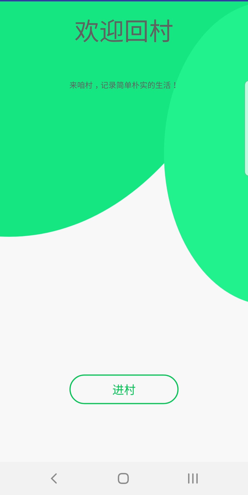
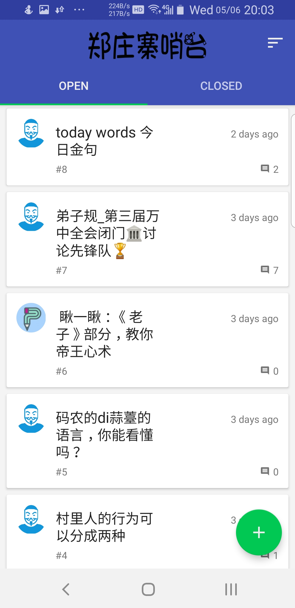
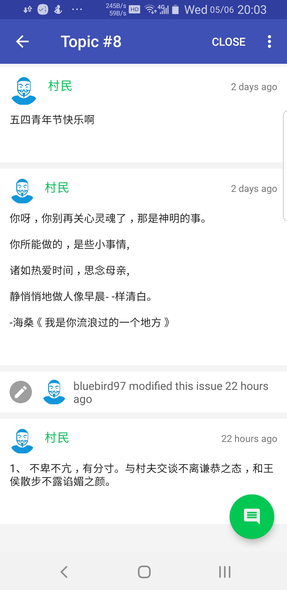
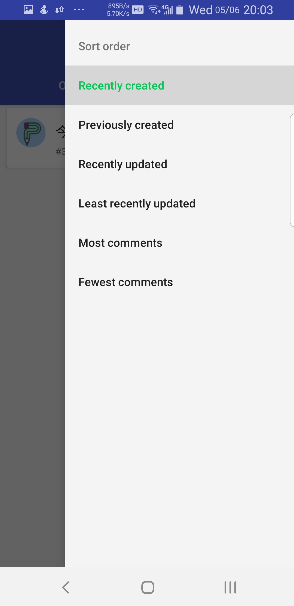
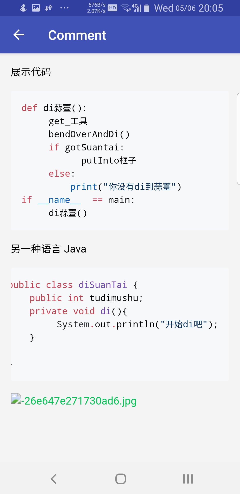
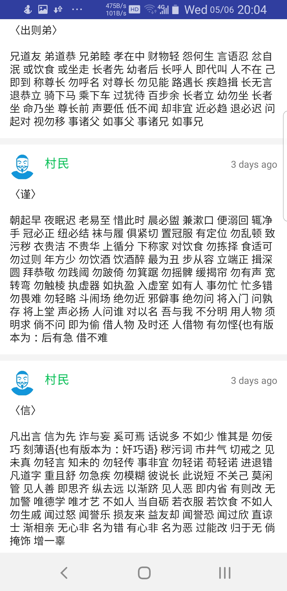

[TOC]

# zzz forum

a anonymous forum for zzz, no user id, no central database(github private repo issue as database)

# screenshot

| 入口 | 主列表 | 话题界面 |
|:-:|:-:|:-:|
||||

| 话题排序 | 话题评论 | 评论列表 |
|:-:|:-:|:-:|
||||

# download here

https://github.com/bluebird97/zzzfourm/blob/master/app/fullName/release/cuncun.apk

# current stage:

next:  run on phone

- fix: 根项目的build.gradle 和 本机的gradle 配置文件，现在我可以下载来自国内阿里和jetpack 的lib 了。
- fix: FragmentComponent injection.
- fix: EditLabelDialog
- fix: LabelManageActivity -> ChooseLabelsDialog and the Fuking labels  -> EditIssueActivity 
- fix: EditIssueActivity
- add: res.layout/menu
- fix: ViewerActivity
- add: SingleFragmentActivity
- fix: most part of: IssueTimelineAdapter
- add: dependency: de.hdodenhof.CircleImageView
- add: CircleBackgroundImageView
- add: IssueTimelineFragment                    
- fix: FragmentPagerModel
- fix: err in BasePresenter
- add: inject part < dagger part < IOC part
- add: ui.activity.base.PagerActivity
- presenter.IssuesActPresenter;
- finish model.filter.IssuesFilter;
- finish Issue.java, User.java, Label.java
- add mvp.modle.Issue and understand Parcelable
- adding mvp, basic

# thanks to:

* [ButterKnife](https://github.com/JakeWharton/butterknife) 视图绑定
* [GreenDao](https://github.com/greenrobot/greenDAO) 一个轻量级而且更快的Android ORM解决方案
* [EventBus](https://github.com/greenrobot/EventBus) 简化Android Activities, Fragments, Threads, Services,等组件之间的通信
* [RxJava](https://github.com/ReactiveX/RxJava) 一个专注于异步编程与控制可观察数据（或者事件）流的API
* [RxAndroid](https://github.com/ReactiveX/RxAndroid) 为了在Android中使用RxJava
* [Retrofit](https://github.com/square/retrofit) 安全的HTTP请求工具库
* [Dagger](https://github.com/google/dagger) 一个快速的依赖注入
* [Glide](https://github.com/bumptech/glide) 一个图像加载和缓存库为了Android中更平滑的滚动
* [code-prettify](https://github.com/google/code-prettify) 代码美化
* [DataAutoAccess](https://github.com/ThirtyDegreesRay/DataAutoAccess) 一个简单的方法去自动存取Android bundle中的数据
* [CircleImageView](https://github.com/vinc3m1/RoundedImageView) 圆形ImageView
* [Toasty](https://github.com/GrenderG/Toasty) 美化的Toast
* [material-about-library](https://github.com/daniel-stoneuk/material-about-library) 让你更容易的创建美丽的关于页面
* [material-dialogs](https://github.com/afollestad/material-dialogs) 一个美丽、流畅的和可自定义的对话框的API
* [GitHub-Trending](https://github.com/thedillonb/GitHub-Trending) 对GitHub趋势页面进行数据抓取
* [RichText](https://github.com/zzhoujay/RichText) Android平台下的富文本解析器，支持Html和Markdown
* [jsoup](https://github.com/jhy/jsoup) HTML解析器
* [OctoDroid](https://github.com/slapperwan/gh4a) GitHub客户端。
* [FastHub](https://github.com/k0shk0sh/FastHub) GitHub客户端。

## special thx to:

* [openhub](https://github.com/ThirtyDegreesRay/OpenHub) GitHub客户端，大部分代码参考此仓库

# License

ThirtyDegreesRay:
> Copyright (C) 2017 ThirtyDegreesRay.
> Licensed under the [GPL-3.0](https://www.gnu.org/licenses/gpl.html).
> (See the [LICENSE](https://github.com/ThirtyDegreesRay/OpenHub/blob/master/LICENSE) file for the whole license text.)

Kosh(There are 13 files has some code copied from FastHub):
> Copyright (C) 2017 Kosh.
> Licensed under the [GPL-3.0](https://www.gnu.org/licenses/gpl.html) license.
> (See the [LICENSE](https://github.com/k0shk0sh/FastHub/blob/master/LICENSE) file for the whole license text.)

